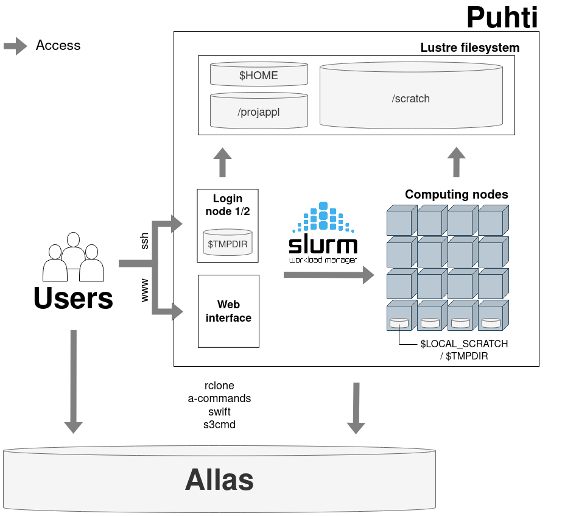

--- 
title: Geoportti computing services for geospatial research at CSC 
subtitle: – potential and challenges
author: Jesse Harrison and Samantha Wittke
date: 10.05.22
lang: en
theme: csc-2019
---

# Practicalities

* who is this workshop for?

* please interrupt ask lots of questions
* shared notes on HackMD

# HackMD

  
[`hackmd.io/@GeospatialCSC/GISRD`](https://hackmd.io/@GeospatialCSC/GISRD/edit)
  

# Today

* Short intro to CSC and available resources
* Group work and discussion time

# Geoportti

* open research infrastructure in Finland 
* science support with access to geospatial data and high performance and cloud computing resources
* promotion of the use of geospatial data and geoinformatics methods in research and university education
* [https://www.geoportti.fi/](https://www.geoportti.fi/)

# CSC

  

# CSC services

[`research.csc.fi/en/service-catalog`](https://research.csc.fi/en/service-catalog)

  

**Compute & Analyze**

  - cPouta / ePouta
  - Puhti / Mahti / LUMI
  - Notebooks

**Store, Share & Publish Data**

  * Allas
  * IDA
  * Paituli
  * EUDAT

# Why use CSC resources?

When own computer is not enough:

* Resource needs (time (> 2 hours), memory (> 8 GB), storage (> 50GB))
**-> Outsource computations, keep own computer free**

* **Server** needs -> cPouta
* **Course computers** (same setup) -> Notebooks
* It’s **free**! (for open science at Finnish university and state research institute users)

# CSC expertise

...at your fingertips:

[`docs.csc.fi`](https://docs.csc.fi)

[`research.csc.fi`](https://research.csc.fi)

**\+ servicedesk@csc.fi**
  

* Geoinformatics team
* Storage team
* Supercomputer team
* Cloudcomputing team
* Accounts team
* ...

# How we can help

* 'Z is not working as expected'
* 'my code gives error Y '
* 'can A be installed to Puhti?'
* 'any advice how to do X?'
* training/example wishes

**-> servicedesk@csc.fi**

[Speed up your request](https://docs.csc.fi/support/support-howto/)

* Setting up pipelines, product provision, R&D, ...

**-> CSC as project partner / subcontractor**

# Computing solutions - Puhti

   

# Puhti webinterface 

  
[`puhti.csc.fi`](https://puhti.csc.fi)
  

# Pouta

# Software

# Python

# R environment on Puhti

- An [Apptainer (Singularity) container](https://docs.csc.fi/computing/containers/run-existing/) including: 
   - R and RStudio Server
   - 1300+ R packages
   - Pre-installed libraries / software required by R packages
   - Software for executing multinode jobs
   - External mathematics library linked to R (Intel® OneMKL)
   - TensorFlow (for using [the R Interface to Tensorflow](https://tensorflow.rstudio.com/))
- Container recipes available in the CSC [singularity-recipes repository](https://github.com/CSCfi/singularity-recipes/tree/main/r-env-singularity)

# R environment on Puhti

  

# Use cases

# Getting started

* [Step by step instructions ](https://research.csc.fi/en/accounts-and-projects)
* [Find your account and project information](my.csc.fi)

* [Read the docs](https://docs.csc.fi)

* check our [tutorials](https://docs.csc.fi/support/tutorials/) and [geocomputing examples](https://github.com/csc-training/geocomputing)

# Training

* ['Using CSC environment efficiently' course](https://csc-training.github.io/csc-env-eff/)
* [Earth Observation workshop](https://ssl.eventilla.com/event/zArJA)
* [Elements of Supercomputing](https://ssl.eventilla.com/event/mlOk6)

-> follow our [training calendar](https://www.csc.fi/en/training#training-calendar)

# Thanks

