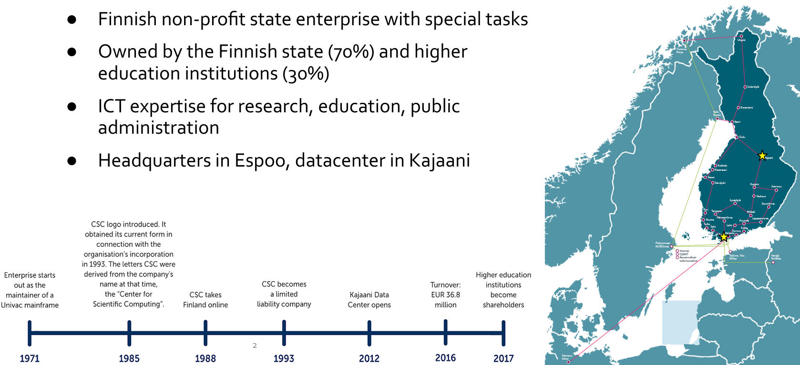
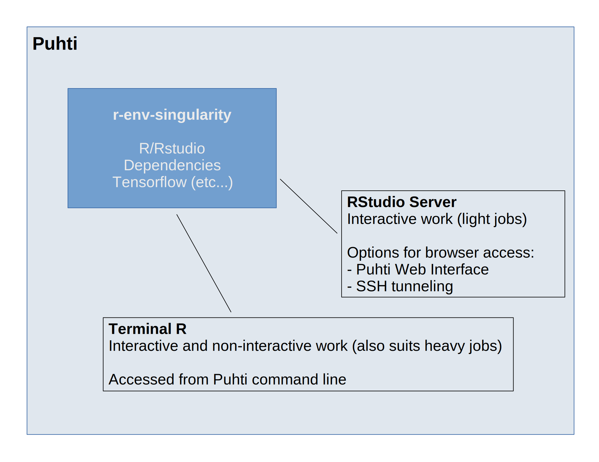

--- 
title: Geoportti computing services for geospatial research at CSC 
subtitle: – potential and challenges
author: Jesse Harrison and Samantha Wittke
date: 10.05.22
lang: en
theme: csc-2019
---

# Geoportti

# CSC

  

# Computing services

# Puhti

# Pouta

# Notebooks

# Python

# R environment on Puhti

- An [Apptainer (Singularity) container](https://docs.csc.fi/computing/containers/run-existing/) including: 
   - R and RStudio Server
   - 1300+ R packages
   - Pre-installed libraries / software required by R packages
   - Software for executing multinode jobs
   - External mathematics library linked to R (Intel® OneMKL)
   - TensorFlow (for using [the R Interface to Tensorflow](https://tensorflow.rstudio.com/))
- Container recipes available in the CSC [singularity-recipes repository](https://github.com/CSCfi/singularity-recipes/tree/main/r-env-singularity)

# R environment on Puhti

  

# Servicedesk

# Data

# Allas

# Paituli

# Getting started

# Help

# Training

# Thanks

